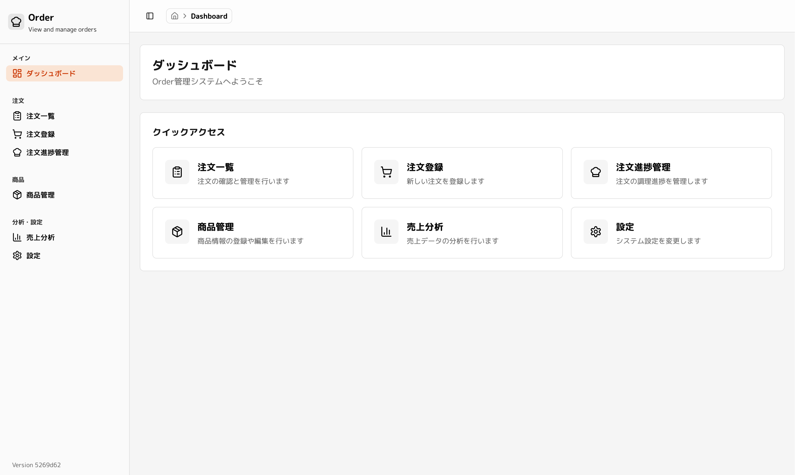
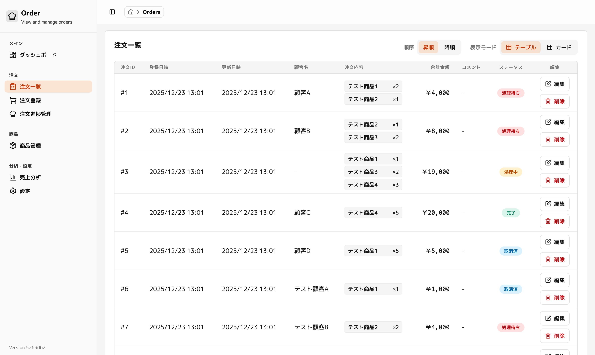
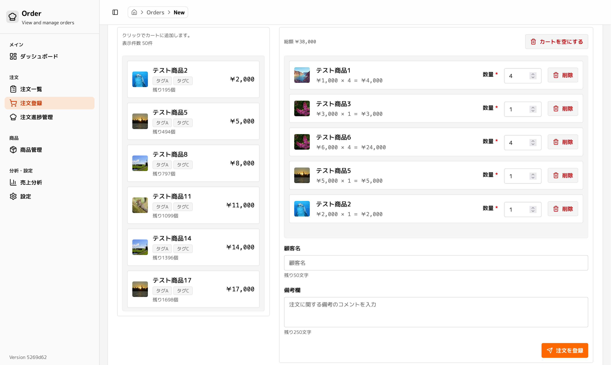
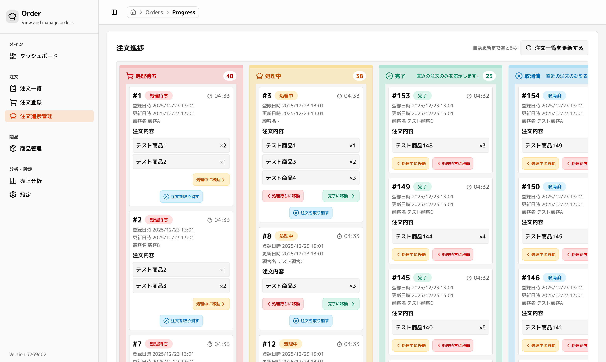
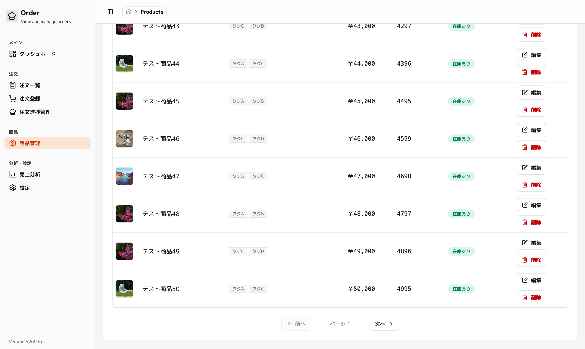

# Order Management System

注文・在庫管理システム

## 機能

### 注文管理

注文の一覧表示、登録、編集、削除が行えます。テーブル表示とカード表示の切り替えに対応しています。

### 注文登録

商品をカートに追加して注文を作成できます。顧客名やコメントの入力にも対応しています。

### 注文進捗管理

カンバン形式で注文の進捗状況を管理できます。ドラッグ&ドロップでステータスの変更が可能です。

### 商品管理

商品の登録・編集・削除、在庫状況の確認ができます。商品画像やタグの設定にも対応しています。

## 技術スタック

- Runtime: [Bun](https://bun.sh/)
- Framework: [HonoX](https://github.com/honojs/honox)
- Build: [Vite](https://vitejs.dev/)
- Database: PostgreSQL / [PGLite](https://github.com/electric-sql/pglite)
- ORM: [Drizzle ORM](https://orm.drizzle.team/)
- Styling: [Tailwind CSS](https://tailwindcss.com/)
- Testing: [Vitest](https://vitest.dev/), [Playwright](https://playwright.dev/)
- Linting: [Biome](https://biomejs.dev/), [Prettier](https://prettier.io/)

## 開発ガイドライン

詳細は[CONTRIBUTING.md](docs/contributing.md)を参照してください。

## アーキテクチャ

詳細は[ARCHITECTURE.md](docs/architecture.md)を参照してください。
