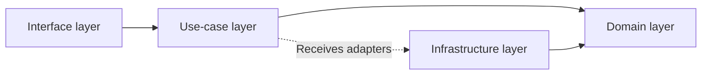

# Architecture

> [!NOTE]
> このドキュメントは開発におけるアーキテクチャの指針をまとめたものです。
>
> ドキュメントは人間とLLMの双方にとって分かりやすく、意図や設計方針が正確に伝わるよう記述してください。

## 基本方針

- Nodeモジュールの依存関係は最小限にする
  - フルスクラッチよりも導入意義が十分大きい場合のみ採用する
  - アプリケーションのソースコードが直接依存しない開発ツールはこの限りではない
- 方針に悩んだときはHonoやHonoXでの無難なやり方に従う
  - 不合理だと思う場合は、改善案とそうあるべき理由をHonoのコミュニティに提案する

## ディレクトリ構成

- `app/`
  - `components/`
    - アプリケーションのほとんどのページで再利用されるコンポーネント
  - `domain/`
    - ドメインロジックの定義
  - `helpers/`
    - 特定のドメインや機能に依存する補助関数
  - `libs/`
    - 外部のライブラリを含んだ大きなロジック
  - `routes/`
    - アプリケーションのルーティング定義
  - `usecases/`
    - ユースケースの実装
  - `utils/`
    - 小さな汎用関数やどこでも使えるシンプルな処理

### 共通

- 関連性の高いもの（一緒に変化するもの）は近くのディレクトリに配置する
  - [コロケーション](https://kentcdodds.com/blog/colocation#the-principle)
- ディレクトリ構成は、技術的詳細よりもドメインを浅い階層に配置する
  - [叫ぶアーキテクチャ](https://blog.cleancoder.com/uncle-bob/2011/09/30/Screaming-Architecture.html)
  - ドメインに依存しない要素も存在するため、type-basedな構成と併用する
- ユニットテストのコードは実装と同じ階層に配置する
- 変更頻度の高いものを変更頻度の低いものに依存させる
  - UIはドメインに比べて変化しやすい
    - [Inside-Out Principle](https://objectclub.jp/technicaldoc/object-orientation/principle/principle02)

### クライアント

- `/app/routes/`以下に`createRoute()`を`export`した`index.tsx`を配置してルーティングを定義する
  - [File-based routing](https://github.com/honojs/honox#routes)を利用する
- コンポーネントは共通化が必要になるまでは分割せずにルーティング定義に直接記述する
- コロケーションに基づき、再利用箇所が限られているコンポーネントは`-components/`、関数は`-helpers/`のディレクトリに配置する
  - `-`から始まるディレクトリはルーティングから除外される
- コンポーネントのファイル名は、サーバーサイドの場合は`camelCase.tsx`、アイランドの場合は`$camelCase.tsx`とし、`export`する名前は`PascalCase`とする
  - [HonoXのドキュメントの例](https://github.com/honojs/honox#interactions)に従う
  - `$`から始まる名前は、HonoXがコンポーネントをアイランドとして認識するための特別な接頭辞
- Hono JSXを使用してUIを構築する
  - Reactと異なり、ループ処理に`key`属性は不要
  - `className`ではなくは`class`を使用する
    - Hono JSXでは`class`と`className`の両方が動作するが、新規実装では`class`を優先する
- 条件分岐を含むスタイルは`tailwind-variants`で管理する
  - コンポーネントが`class`を受け取ってスタイルを合成することは認めない
  - 単一の静的なスタイルの場合は、`tv`を使用せず直接`class`を指定する
- 色は`app/style.css`に定義されたdesign tokensを参照する

#### アイランド

- 原則として、HTML/CSSのみで実現できることはクライアントサイドのJavaScriptで実装しない
- ただしユーザー体験（UX）が大きく向上し、静的なHTML/CSSだけでは実現しにくい振る舞いがある場合はクライアントコンポーネントを導入する
- クライアントコンポーネントが利用するAPIは`app/routes/api/`に定義する
  - 命名やレスポンスの形式は、コンポーネントやユースケースに特化したものとする
  - RESTfulである必要はない
- クライアントではHono clientを使用して型安全にAPIと通信する
  - ヘルパー関数`createHonoClient()`を利用する
  - `Date`型は受信時に`string`型から変換する必要があるため注意する

### サーバー

- 目的
  - フレームワークに依存しない
  - UIに依存しない
  - 外部エージェントに依存しない
  - データの永続化手段に依存しない
  - テストが容易
- 原則
  - 読み取りと書き込みは分離する
    - [Command Query Responsibility Segregation](https://martinfowler.com/bliki/CQRS.html)
  - 依存性は具体から抽象に向け、制御の流れと依存関係を分離する
    - [Dependency Inversion Principle](https://martinfowler.com/articles/dipInTheWild.html)

#### レイヤー構成と責務

- インターフェース層
  - 外部から入力手段を定義する
    - UIとの結合度が高いため、クライアントの実装に近い場所で管理する
    - クライアントのためのバリデーションと、ユースケース層のユースケース関数の呼び出しを行う
- ユースケース層
  - アプリケーション固有のビジネスロジックの実装を定義する
  - トランザクションはユースケース層で開始・管理し、他のレイヤーではトランザクションを管理しない
    - ドメイン層の抽象リポジトリを利用して、ビジネスロジックをユースケース関数として実装する
    - ドメインを跨いだ値の整合性の担保や、クライアントを意識した変換・集計を行う
    - ユースケース固有の設定値を管理する
      - リポジトリ関数に渡すページネーションのデフォルト値はここで定義する
      - 異なるユースケースで値が一致していても、独立したユースケースであれば個別に定義する
        - 過度な一般化（複数のユースケースで共有する定数ファイルの作成など）は避ける
    - ドメインのリポジトリ関数が返したエラーメッセージのうち、クライアントに返す必要があるものを選択して返却する
- ドメイン層
  - エンティティ、値オブジェクト、抽象リポジトリを定義する
    - 抽象リポジトリでは、型・値の制約、不変条件などの単体で完結するデータの整合性に加え、同じドメイン内の他リソースとの関係の制約を他の抽象リポジトリを利用して担保する
      - 複数のリポジトリが類似した意味論を持つ場合でも、汎用的な抽象化を避け、独立した関数として定義する
        - 例えば、フィルターやオーダーのみが違う場合でも、独立した抽象リポジトリ関数として定義する
        - 各リポジトリ関数の独立性により、実装の変更や拡張を容易にするため
    - 抽象リポジトリ関数はドメイン単位でfactoryパターンのオブジェクトとして定義し、リポジトリの実装（adapters）を引数で受け取る形で依存性を注入する
      - リポジトリの利用時には、`app/usecases/repositories-provider.ts`で各ドメインのadapterを注入したrepositoryをユースケース層に提供する
    - 抽象リポジトリでの取得や操作の結果は`Result<T, E>`型で返却される
      - 型引数`E`にはとりうるドメインロジックに関するエラーメッセージをUnion型で定義する
- インフラストラクチャ層
  - データベースや外部APIとの通信方法を定義する
    - ドメイン層で定義される抽象リポジトリの実装を提供する
      - 異なるリポジトリは独立した実装を持つ
        - 複数のリポジトリが類似した処理を持つ場合でも、汎用ヘルパー関数で統合しない
        - 各リポジトリの実装の独立性を保ち、将来の変更対応を容易にするため
        - ただし定数抽出や共通変換関数など、非侵襲的な冗長性削減は推奨される
    - 共有ライブラリ（`app/libs/db`など）とドメイン配下の`adapters.ts`がインフラ層を構成し、ドメインが要求する戻り値の整形や例外戦略を満たす
      - DBや外部APIなどの具体的な実装の詳細を扱うadapterは抽象リポジトリ関数と変更頻度が近いため、`app/domain/${domain-name}/adapters.ts`にコロケーションするが、ドメインの他のファイルからは参照されない
  - 削除操作はべき等性を保つ
    - 削除対象のリソースが存在しない場合でもエラーにしない
    - 削除命令を受け取ったら「このリソースは削除すべき」という意図が満たされたと見なす
    - 存在確認が必要な場合は、ユースケース層でQuery系リポジトリを使用して明示的に行う

## バリデーション

- バリデーションの違い
  - クライアント側
    - ユーザーフレンドリーな検証とフィードバックはHTMLのバリデーション属性やクライアントコンポーネントで提供する
  - サーバー側
    - インターフェース層は入力のパースと型の正規化を担う
      - ここでは文字列から数値への変換などのユースケース層に渡すための形式を保証する
      - 不正な形式のリクエストには汎用的なエラーを返す
    - ユースケース層やドメイン層では、セキュリティとデータの整合性を保つための厳格なバリデーションを行う
      - 不正なデータや攻撃からシステムを守るために、あらゆる入力を検証する必要がある
      - ユーザーへのフィードバックは原則意識しない
        - 一意性や外部リソースの照会などのクライアントだけで検証できない事項は、サーバー側での検証結果を基にユーザーにフィードバックを提供する場合もある

## テスト方針

- 単体テスト（unit test）はBun testを利用する
- 統合テスト（integration test）はVitestを利用する
  - HonoXがViteの拡張仕様に依存しているため
- E2Eテスト（end-to-end test）はPlaywrightを利用する
