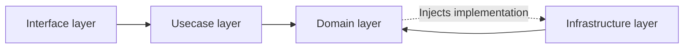

# Architecture

> [!NOTE]
> このドキュメントは開発におけるアーキテクチャの指針をまとめたものです。
>
> 人間とLLMの双方にとって分かりやすく、意図や設計方針が正確に伝わるよう記述してください。

## 基本方針

- Nodeモジュールの依存関係は最小限にする
  - フルスクラッチよりも導入意義が十分大きい場合のみ採用する
  - アプリケーションのソースコードが直接依存しない開発ツールはこの限りではない
- HTML/CSSのみで実現できることをクライアントサイドのJavaScriptで実装しない
- 方針に悩んだときはHonoやHonoXでの無難なやり方に従う
  - 不合理だと思う場合は、改善案とそうあるべき理由をHonoのコミュニティに提案する

## ディレクトリ構成

- `app/`
  - `components/`
    - アプリケーションのほとんどのページで再利用されるコンポーネント
  - `domain/`
    - ドメインロジックの定義
  - `helpers/`
    - 特定のドメインや機能に依存する補助関数
  - `infrastructure/`
    - データの永続化や外部APIとの通信方法の実装
  - `libs/`
    - 外部ライブラリや大きなロジック
  - `routes/`
    - アプリケーションのルーティング定義
  - `usecases/`
    - ユースケースの実装
  - `utils/`
    - 小さな汎用関数やどこでも使えるシンプルな処理

### 共通

- 関連性の高いもの（一緒に変化するもの）は近くのディレクトリに配置する
  - [コロケーション](https://kentcdodds.com/blog/colocation#the-principle)
- ディレクトリ構成は、技術的詳細よりもドメインを浅い階層に配置する
  - [叫ぶアーキテクチャ](https://blog.cleancoder.com/uncle-bob/2011/09/30/Screaming-Architecture.html)
  - ドメインに依存しない要素も存在するため、type-basedな構成と併用する
- ユニットテストのコードは実装と同じ階層に配置する
- 変更頻度の高いものを変更頻度の低いものに依存させる
  - UIはドメインに比べて変化しやすい
    - [Inside-Out Principle](https://objectclub.jp/technicaldoc/object-orientation/principle/principle02)

### クライアント

- `/app/routes/`以下に`createRoute()`を`export`した`index.tsx`を配置してルーティングを定義する
  - [File-based routing](https://github.com/honojs/honox#routes)を利用する
- コロケーションに基づき、再利用箇所が限られているコンポーネントや関数は`-`から始まるディレクトリに配置する
  - `-`から始まるディレクトリはルーティングから除外される
- コンポーネントのファイル名は、サーバーサイドの場合は`camelCase.tsx`、アイランドの場合は`$camelCase.tsx`とし、`export`する名前は`PascalCase`とする
  - [HonoXのドキュメントの例](https://github.com/honojs/honox#interactions)に従う
  - `$`から始まる名前は、HonoXがコンポーネントをアイランドとして認識するための特別な接頭辞
- Hono JSXを使用してUIを構築する
  - Reactと異なり、ループ処理に`key`属性は不要
- 条件分岐を含むスタイルは`tailwind-variants`で管理する
  - コンポーネントが`class`を受け取ってスタイルを合成することは認めない
  - 単一の静的なスタイルの場合は、`tv`を使用せず直接`class`を指定する
- 色は`app/style.css`に定義されたdesign tokensを参照する

### サーバー

- 目的
  - フレームワークに依存しない
  - UIに依存しない
  - 外部エージェントに依存しない
  - データの永続化手段に依存しない
  - テストが容易
- 原則
  - 読み取りと書き込みは分離する
    - [Command Query Responsibility Segregation](https://martinfowler.com/bliki/CQRS.html)
  - 依存性は具体から抽象に向け、制御の流れと依存関係を分離する
    - [Dependency Inversion Principle](https://martinfowler.com/articles/dipInTheWild.html)

#### レイヤー構成と責務

- インターフェース層
  - 外部から入力手段を定義する
    - UIとの結合度が高いため、クライアントの実装に近い場所で管理する
    - クライアントのためのバリデーションと、ユースケース層のユースケース関数の呼び出しを行う
- ユースケース層
  - アプリケーション固有のビジネスロジックの実装を定義する
    - ドメイン層の抽象リポジトリを利用して、ビジネスロジックをユースケース関数として実装する
    - ドメインを跨いだ値の整合性の担保や、クライアントを意識した変換・集計を行う
- ドメイン層
  - エンティティ、値オブジェクト、抽象リポジトリを定義する
    - 抽象リポジトリでは、型・値の制約、不変条件などの単体で完結するデータの整合性に加え、同じドメイン内の他リソースとの関係の制約を他の抽象リポジトリを利用して担保する
    - 抽象リポジトリ関数では、デフォルト引数としてリポジトリの実装を予め注入する
      - 抽象リポジトリ関数の利用者は依存性を意識する必要はなく、テストを容易にするため
- インフラストラクチャ層
  - データベースや外部APIとの通信方法を定義する
    - ドメイン層で定義される抽象リポジトリの実装を提供する

## バリデーション

- バリデーションの違い
  - クライアント側では、ユーザーにフィードバックを提供するためのバリデーションを行う
    - 提供しているフォームから送信可能なデータのみを意識すればよい
    - 必要に応じて、入力値の種類ごとに細かいフィードバックを行う
  - サーバー側では、セキュリティとデータの整合性を保つための厳格なバリデーションを行う
    - 不正なデータや攻撃からシステムを守るために、あらゆる入力を検証する必要がある
    - ユーザーへのフィードバックは意識しない
